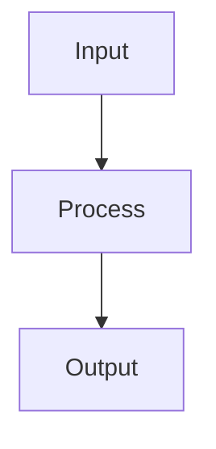

### 1. Core Theory Definition Prompt

**Name:** `STRUCTURED_THEORY`
> Define the topic and state its core principle in 3-4 separate sentences.
> Each sentence must contain 12-16 words exactly.

---

### 2. Feature Analysis Prompt

**Name:** `THREE_BY_THREE_ANALYSIS`
> **Features (3x two words):**
> **Advantages (3x two words):**
> **Limitations (3x two words):**

---

### 3. Goals & Objectives Prompt

**Name:** `GOAL_STRUCTURE`
> List the primary goals in 3-4 bullet points.
> Each bullet point must be a single sentence of 10-15 words.

---

### 4. Functions & Operations Prompt

**Name:** `FUNCTION_LIST`
> Enumerate the core functions using a numbered list (1-5).
> Each function must be explained in one sentence of 12-16 words.

---

### 5. Characteristics & Properties Prompt

**Name:** `CHARACTERISTIC_TABLE`
> List 5 key characteristics in a table.
> **Format:**
> # | Characteristic | Description
> --- | --- | ---
> 1 | [Two words] | [One sentence, 8-12 words]
> ... (up to 5)

---

### 6. Tabular Comparison Prompt

**Name:** `STRICT_TABLE_RESPONSE`
> Answer each question strictly in a table. Each cell uses 2-4 words only.
> No introductions, summaries, or remarks before/after the table.
>
> **Format:**
> Factor | Topic1 | Topic2 | ... | TopicN

---

### 7. Explain & Elaborate Prompt

**Name:** `EXPLAIN_STRUCTURED`
> Provide a structured explanation covering the topic's definition, key features, advantages, limitations, and a conceptual diagram.
> This response should be a cohesive and well-organized explanation, suitable for an exam-style answer. It must include a Mermaid diagram to illustrate the core concept.

---

### 8. Extreme Conclusion Prompt

**Name:** `EXTREME_GEN_CONCLUSION`
> Write one extreme generalized conclusion sentence for the given aim.
> Sentence must be exactly 15 words long.
> No introductions, summaries, or remarks before/after the conclusion.

---

### 9. Syllabus Question Extractor Prompt

**Name:** `MODULE_TABLE_EXTRACTOR`
> Extract all questions from the syllabus PDFs. Sort into tables by modules 1-6.
> Table columns: # | question | marks | Month & Year
> Use only the character '#' for serial numbers.
> No introductions, summaries, or remarks before/after the table.

---

### 10. Answer Writing (General Rules for ALL Responses)

Answer every question **completely, independently, and in a clean exam-style format**.
Do not assume the reader has seen any other answer.

#### 10.1 General Rules

- Each question must receive a **full standalone answer**.
- If similar or repeated questions appear, **write the full answer again from scratch** for each occurrence.
- Never use the following phrases (or their equivalents):
  - “Same as above”
  - “Repeated answer”
  - “Refer previous answer”
  - “Already explained”
  - “As mentioned earlier”

#### 10.2 Answer Length Guidelines

| Question Marks   | Length Guideline                        |
| ---------------- | --------------------------------------- |
| 5 marks          | Concise (generally **under 100 words**) |
| 10 marks         | Detailed explanation (~**200 words**)   |
| Part of 20 marks | Concise (generally **under 100 words**) |

> If marks are not specified, use your best judgment based on question complexity.

#### 10.3 Formatting Rules

###### Headings
- Use `# Module Name` for module titles.
- Use `## Question text (marks)` for each question.

###### Structure
- Use bullet points, numbered lists, tables, or short paragraphs as appropriate.
- Do **not** include:
  - Question numbers (Q1, Q2)
  - Marks in brackets
  - Exam month/year

###### Question Format (Correct Example)

```markdown
# Network Security Module 2

## Explain the attacks on Network and Prevention (10 marks)
```

###### Question Format (Incorrect Example)

```markdown
Question 1: Explain the attacks on Network and Prevention. (10 marks, DEC 2024)
```

#### 10.4 Diagram Rules (Mermaid)

- Use **Mermaid syntax only**.
- Every diagram must contain a **maximum of 7 nodes**.
- Prefer **compact vertical layouts** using `graph TD`.
- Avoid wide left-to-right diagrams unless strictly necessary.
- Keep node labels **short and readable**.
- Leave **blank lines before and after** each Mermaid block.
- Do **not** place Mermaid diagrams inside lists or tables.
- Prefer **multiple small diagrams** over one large diagram.
- Diagrams must be **PDF-export friendly** (simple, no exotic shapes).
- **When to use diagrams:** Use a conceptual Mermaid diagram for any `EXPLAIN_STRUCTURED` prompt, or when a response benefits from illustrating a process, architecture, or relationship.

###### Example Diagram



#### 10.5 Writing Style

- Use **simple academic English**.
- Avoid unnecessary background or filler.
- Be **direct and precise**.
- Maintain consistent terminology across all answers.
- Ensure **readability** with proper spacing and line breaks.

#### 10.6 Final Output Structure

For each answer, follow this template exactly:

```markdown
# Module Name

## Question text (exactly as given) (marks)

Answer content written in paragraphs, bullet points, or tables.


#### 10.7 Self-Check Before Submitting

- [ ] Is every answer standalone (no references to other answers)?
- [ ] Are forbidden phrases absent?
- [ ] Is the length appropriate for the marks?
- [ ] Are Mermaid diagrams ≤7 nodes and vertically oriented?
- [ ] Are there no question numbers or exam metadata?
- [ ] Is the writing clear and academic?
- [ ] For `EXPLAIN_STRUCTURED` prompts, is a conceptual diagram included?
- [ ] Are list, table, or diagram formats used correctly as specified by the prompt type?
